 

  ***Tutorial de*** <i class="fab fa-r-project"></i> ! 

 

***

 

*Este tutorial de <i class="fab fa-r-project"></i> é dedicado aos membros do {width=100px}*

 

Além das etapas iniciais de familiarização com o software são apresentadas aplicações específicas pertinentes ao tema da economia do meio ambiente e desenvolvimento sustentável. 
 

 

***

# Instalando o <i class="fab fa-r-project"></i> e o RStudio 

Para baixar o software visite o link: https://cran.r-project.org/  

 

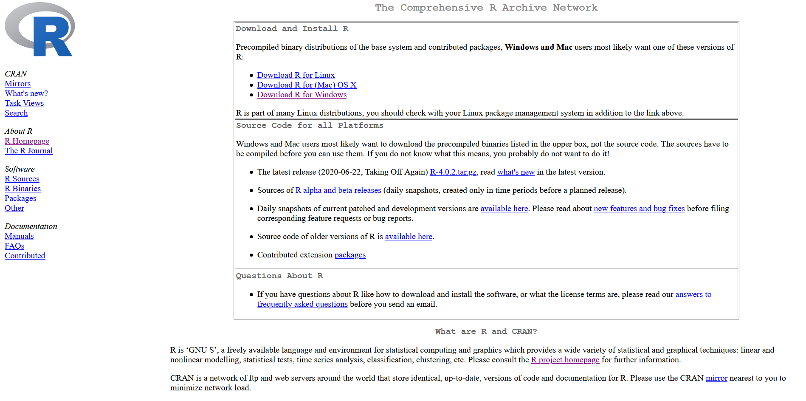

 

Selecione entre as opções de acordo com o seu sistema operacional (OS, na sigla em inglês).

***

## Windows <i class="fab fa-windows"></i>

A opção Download R for Windows abre a seguinte janela:

 

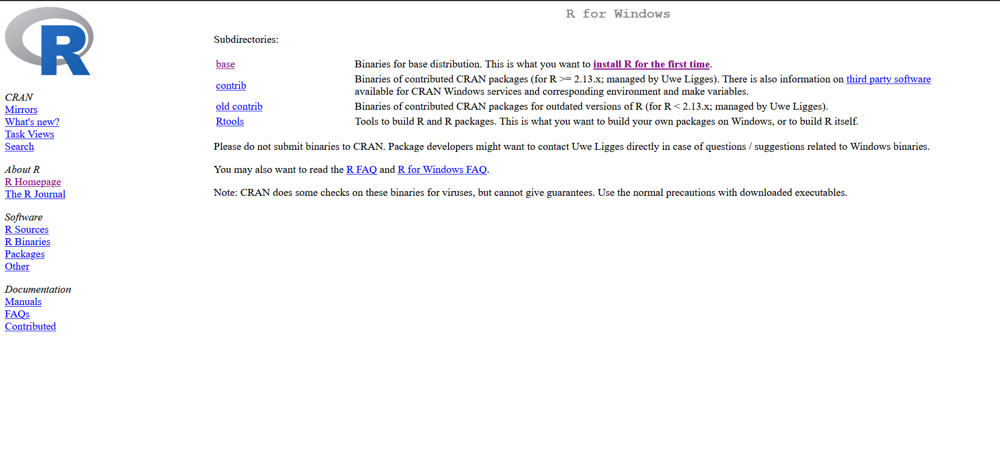

 

Os hyperlinks base ou install R for the first time redirecionam para o repositório:  

 

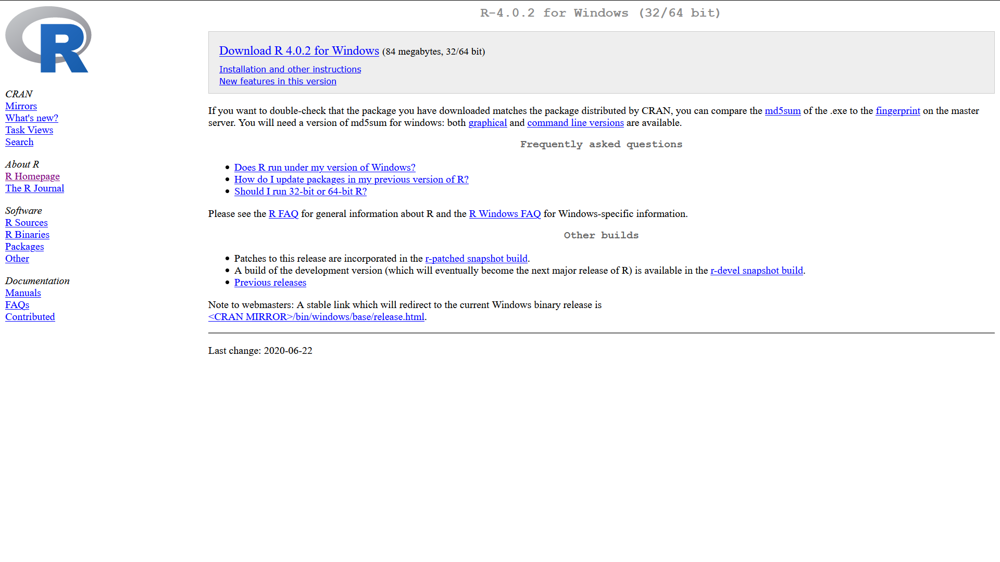

Clique em Download R 4.0.2 for Windows, ou na versão mais recente que estiver disponível. Ao salvar e executar o arquivo o download será iniciado. Basta seguir as instruções de instalação.

 

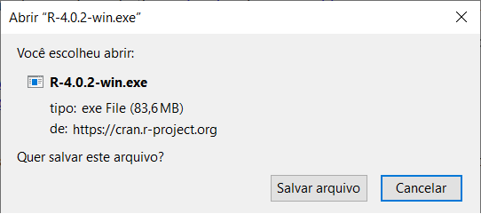

 

Por fim, é importante verificar onde os arquivos baixados estão salvos, este será o seu **diretório** principal! <i class="fas fa-home"></i>

***

Para os usuários de Windows, recomenda-se também a instalação do **Rtools** que permite a criação de pacotes.  

O download pode ser feito pelo link https://cran.r-project.org/bin/windows/Rtools/. Escolha a melhor opção de acordo com o Windows (32 ou 64-bit) instalado em seu computador.

***

Caso seja necessário, para descobrir se o seu OS roda em 32-bits ou 64-bits, abra o Prompt de Comando do Windows:

 

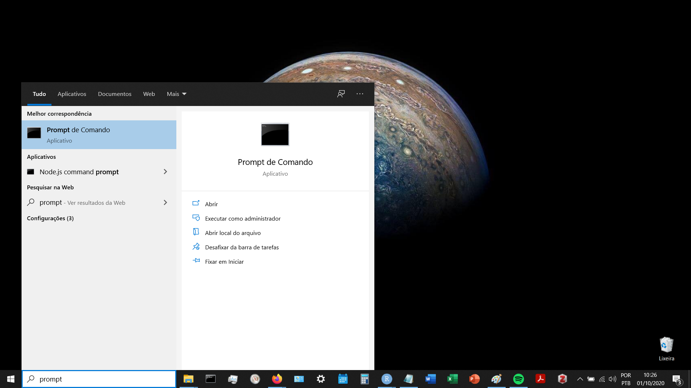

 

Copie e cole a seguinte linha de comando `wmic os get osarchitecture` e pressione Enter.  

 

***

## Mac <i class="fab fa-apple"></i> e Linux <i class="fab fa-linux"></i>

Para instalar o R em computadores com o sistema operacional Mac você deverá clicar em Download R for (Mac) OS X. Na página seguinte, clique em R-4.0.2.pkg ou em outra versão mais atual.

Se você utiliza Linux o R pode ser instalado no Ubuntu diretamente pelo terminal usando o seguinte script Bash:

`sudo apt-get install r-base`

***

## Download do RStudio

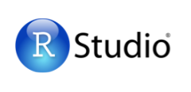

O RStudio é um ambiente de desenvolvimento integrado ou *integrated development environment* (IDE). Um IDE reúne características e ferramentas de apoio ao desenvolvimento de software com o objetivo de agilizar este processo.  

Para fazer o download do RStudio, acesse: https://rstudio.com/products/rstudio/download/  

 

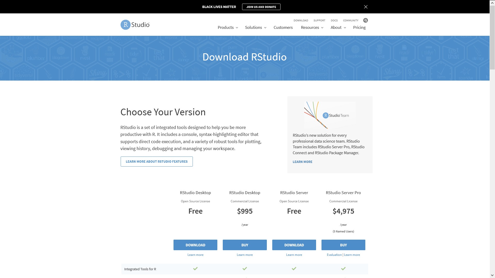

 

Clique na opção gratuita e o site irá redirecionar para o repositório e indicará a melhor versão para o seu OS.

 

***

# Funcionalidades do RStudio

Ao abrir o RStudio, inicia-se uma sessão do programa  

 

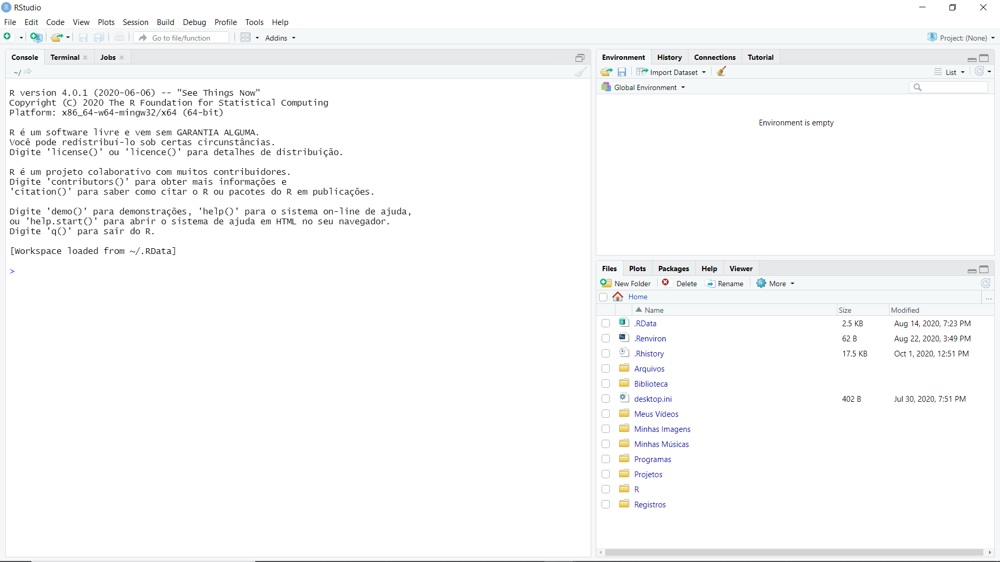

  

Note que a versão e a plataforma que o programa está rodando são informadas no **console**:

>R version 4.0.1 (2020-06-06) -- "See Things Now"  
Copyright (C) 2020 The R Foundation for Statistical Computing  
Platform: x86_64-w64-mingw32/x64 (64-bit)

***

Na imagem acima podemos ver três painéis. Para ampliar/reduzir os painéis, basta clicar com o cursor sobre as divisórias e arrastá-las. Também há botões <i class="far fa-window-maximize"></i> de minimização e ampliação em cada painel.  

Outras opções de layout dos painéis podem ser definidas em > Tools > Global Options > Panel Layout

 

  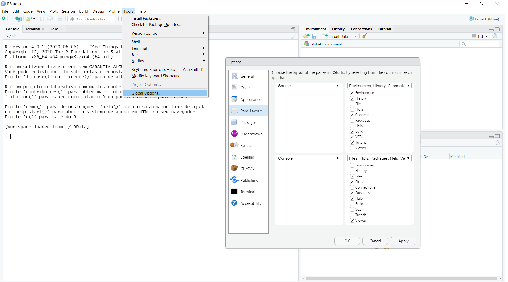

  

***

 

 

   
  
O Panel Layout permite incluir/remover abas com demais funcionalidades, além de trocar a posição de cada painel.  

***

## Console

O painel do **Console** roda os comandos e exibe seus resultados, erros e avisos. Este é o painel que informa as ações que estão sendo realizadas e o histórico de ações - na sequência em que foram executados. Não há como salvar os comandos executados apenas no console, para isso usaremos o Source Editor (ver seção seguinte) criando um documento com a extensão adequada.  

Para limpar o console digite Ctrl+L ou clique no icone <i class="fas fa-broom"></i> no canto direito do painel.

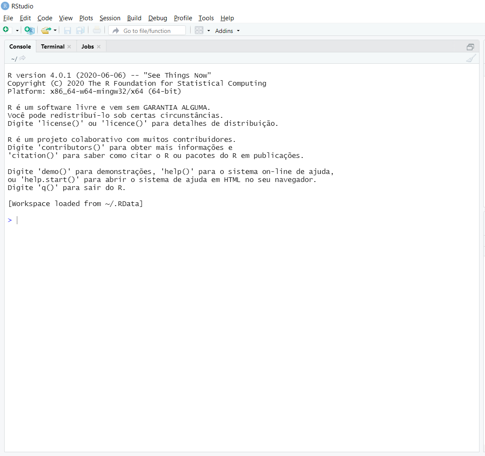

 

***

## Source

Ao iniciar a edição de um documento, abre-se o painel **Source**. Este é o editor de códigos (scripts) para todos os formatos de arquivos disponíveis no R. Para iniciar um novo documento clique no botão <i class="fas fa-plus-circle"></i> que irá abrir o seguinte menu de opções

  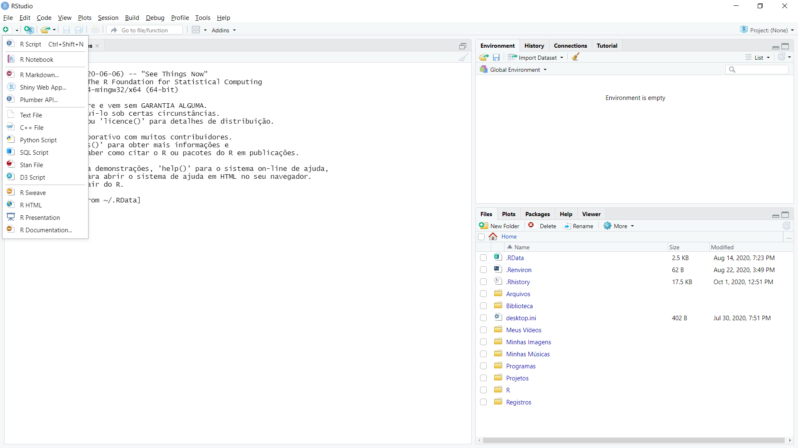

  

***

 

 

   

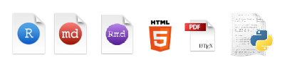

Dentre os tipos de arquivos disponíveis estão R Script, C++, R Markdown, Python Script, R HTML... Este tutorial está escrito em arquivos de R Markdown, com complementos de CSS e HTML, todos editados no RStudio. Para publicar o site utilizou-se o GitHub <i class="fab fa-github"></i>. Todos os códigos e imagens utilizados neste tutorial estão diponíveis para acesso no [repositório do GitHub](https://github.com/abreucarvalho/tutorial-R).

***

Os códigos próprios para R são criados em documentos de texto com extensão .R, os R Scripts.    

Para abrir um novo R Script basta pressionar Ctrl+Shift+N  

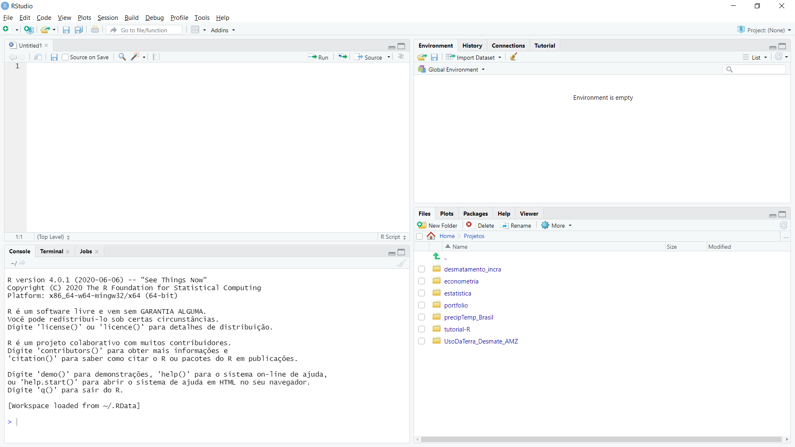

***

 

Para salvar, pressione Ctrl+S, ou clique no icone de disquete <i class="fas fa-save"></i>, ou ainda via File > Save.  
 

<i class="fas fa-exclamation-triangle"></i><strong> Lembre-se sempre de salvar o seu trabalho!</strong>

 

Alguns outros recursos de recuperação do histórico de modificação e controle de versão serão discutidos mais adiante. 

Note ainda, na imagem abaixo, que ao editar o documento seu nome na aba muda de cor e surge um asterisco ao final, indicando que as alterações não foram salvas. Ao salvar a cor muda novamente e o asterisco some. 

***

Também será possível visualizar as tabelas de dados neste painel, o que abrirá uma nova aba.

Outros botões estão disponíveis no cabeçalho do Source Editor. Em ordem, da esquerda para a direita, as setas permitem navegar entre abas de diferentes documentos/tabelas, alternativamente pressione Crtl+Tab e Ctrl+Shift+Tab; o segundo botão permite abrir cada aba numa nova janela destacada do RStudio (clique para testar), ao clicar novamente o mesmo botão a janela volta a ser uma aba; e a lupa <i class="fas fa-search"></i> permite buscar caracteres no código de forma dinâmica.  

 

  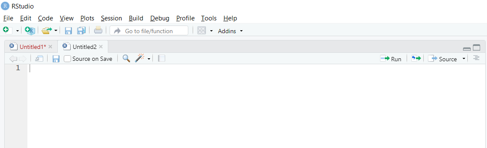

  

No canto direito do painel encontra-se o botão *"Run"* corresponde ao comando Ctrl+Enter e roda as *linhas selecionadas*. Este será o comando mais utilizado! 

Assim como para os botões acima, recomenda-se criar o hábito de uso dos atalhos via teclado ao invés do point-click do mouse, sempre que possível. 

***

## Environment

O painel denominado **Environment** armazena todos os objetos e funções criados em uma determinada sessão. A aba Environment exibe estes objetos e alguns de seus detalhes. O icone <i class="fas fa-broom"></i> remove todos os objetos, equivalente a linha de comando `rm(list = ls())`

A aba History registra os comandos executados anteriormente, para ter uma versão completa deste histórico, ao final da sessão, salve o arquivo .RData. 

 

{width=800px}

 

***

Uma última aba de interesse para essa etapa de familiarização é a aba Tutorial (R version > 4.0.1). Vale a pena explorar os tutoriais disponíveis sobre diversos assuntos específicos. Um outro recurso parecido é o [Swirl](https://swirlstats.com/).

 

***

## Files

Por fim, o painel que denominaremos de **Files** exibe seu diretório principal <i class="fas fa-home"></i>. A aba Plots é onde visualizaremos os gráficos, mapas e quaisquer tipos de imagens e animações. A aba Packages contém a lista de pacotes que são extensões para o R. Permite pesquisar, instalar e atualizar quaisquer pacotes disponíveis no [CRAN](https://cran.r-project.org/) ou outros repositórios online. A aba Help é onde encontraremos a [documentação](https://www.rdocumentation.org/) dos pacotes e de suas respectivas funções, com descrições, parâmetros e demais detalhes de como utilizá-las. 

 

{width=800px}

 

***

$\Re$

***

